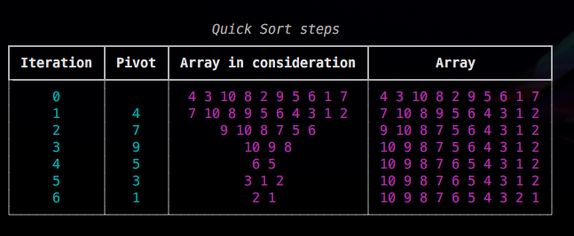
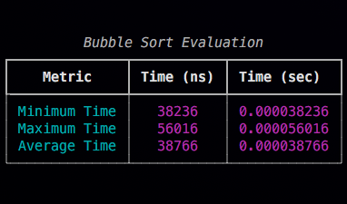
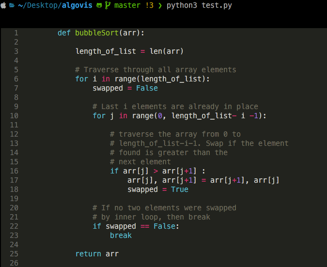

[](https://www.codefactor.io/repository/github/hotshot07/algovis/overview/master)    [](https://pepy.tech/project/algovis) <!--  -->     


Algovis is a python library made for visualizing algorithms. You can access the documentation [here](https://algovisdocs.netlify.app/)

Currently the library has these algorithms

#### Sorting

- Bubble Sort
- Insertion Sort
- Selection Sort
- Merge Sort
- Quick Sort

#### Searching

- Linear Search
- Binary Search


## Getting Started

### Prerequisites

I would highly suggest making a virtual environment. The main purpose of Python virtual environments is to create an isolated environment for Python projects. You can read more about them [here](https://realpython.com/python-virtual-environments-a-primer/).

```bash
# making a test folder

$mkdir test_algovis

# make it the current directory

$cd test_algovis

# making a virtual environment (you can replace envname with whatever name you like)

$python3 -m venv envname

# activating it

$source envname/bin/activate

```

You can only access algovis inside this virtual environment. To leave this virtualenv when you're done trying out the library, type

```bash
$deactivate
```

### Installing

```bash
$pip3 install algovis
```
### Using the library

#### Visualize method

```python
# import the sorting module from library
from algovis import sorting

# importing random library to fill it a list with random integers
import random

# Making a list of 100 integers from 1-100
# using list comprehension
my_list = [i+1 for i in range(100)]

# shuffling the list using random module
random.shuffle(my_list)

# Making a BubbleSort class object
bs_object = sorting.BubbleSort(my_list)

# calling the visualize method
bs_object.visualize(interval= 100)
```
##### Output


#### Sort method

```python
# lets work on a shorter example now
my_list = [i + 1 for i in range(10)]

# shuffling the list using random module
random.shuffle(my_list)

#making a quicksort object
qs_object = sorting.QuickSort(my_list)

#sorting in reverse with steps
qs_object.sort(steps = True, reverse = True, pivot = "first")

# you can see the pivot placed correctly in the 'array in consideration' column
# the whole array at that iteration is shown in 'array' column
```

##### Output



#### Evaluate method
```python
# Making a BubbleSort class object
bs_object = sorting.BubbleSort(my_list)

# calling the evaluate method
bs_object.evaluate(iterations = 100)
```
##### Output



#### Info method
```python
#assuming you already have any sorting object, just call
bs_object.info()

# here i've used the bs_object used earlier in the code
```
##### Output


#### code method
```python
bs_object.code()
```
###### Output



My terminal config is iTerm2 + ohmyzsh + powerlevel10k with dark backgroud. Colors may appear different in your terminal output. It's recommended to change the terminal color to something darker

### Built With

* [Poetry](https://python-poetry.org/) - Python packaging and dependency management tool
* [Matplotlib](https://pypi.org/project/matplotlib/) - Matplotlib is a comprehensive library for creating static, animated, and interactive visualizations in Python.
* [Rich](https://pypi.org/project/rich/) - Rich is a Python library for rich text and beautiful formatting in the terminal made by @willmcgugan

### Doumentation
The documentation is built with MKdocs using material theme and is hosted on netlify. You can access it [here](https://algovisdocs.netlify.app/)

### Author

* **Mayank Arora** *(hotshot07)*

### Acknowledgements
*

### License

This project is licensed under the GNU Affero General Public License v3 (AGPL-3.0) - see the [LICENSE](LICENSE) file for details